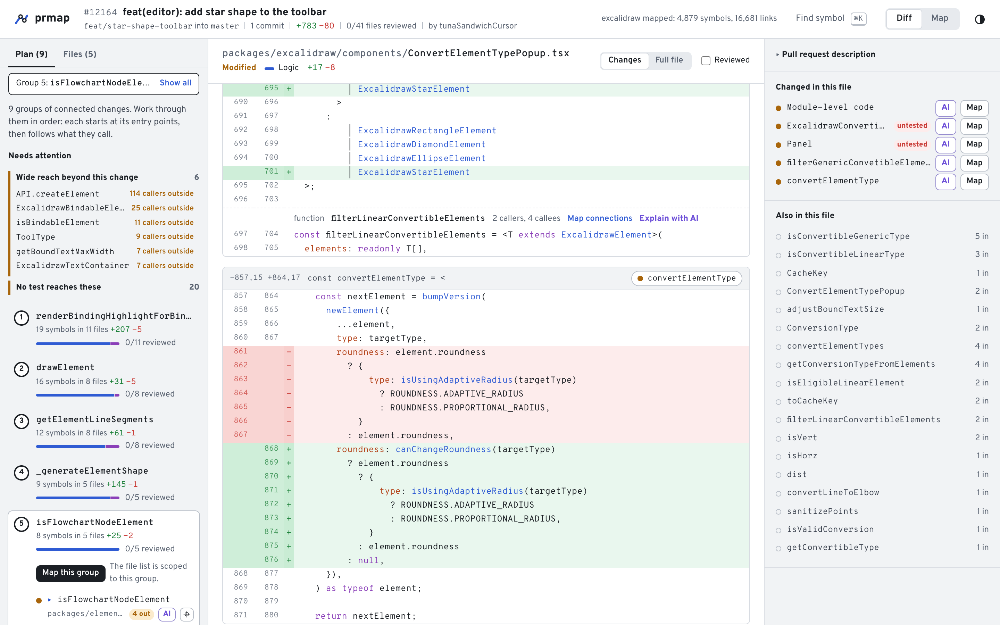
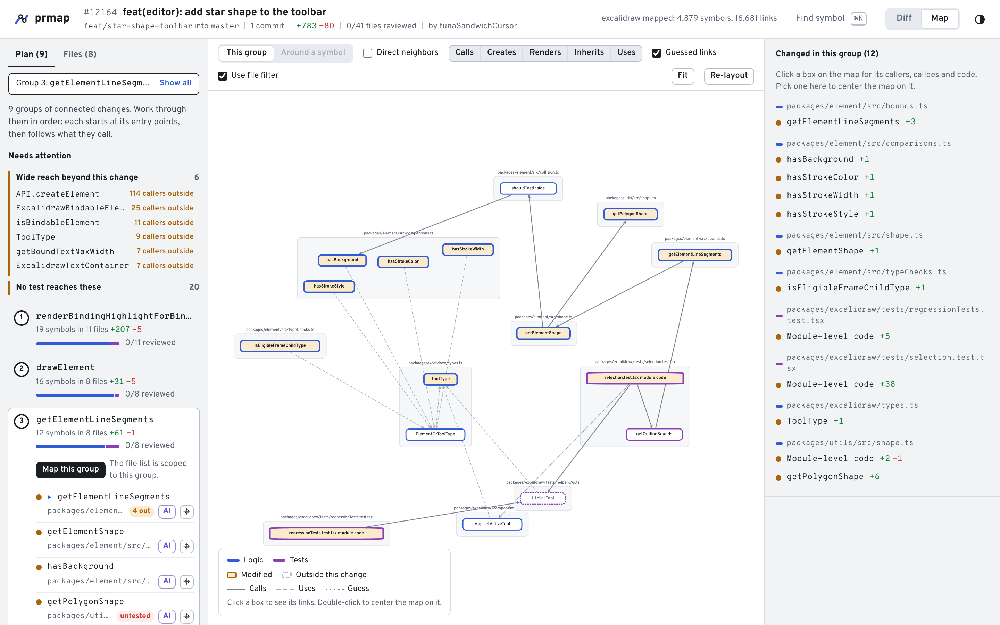
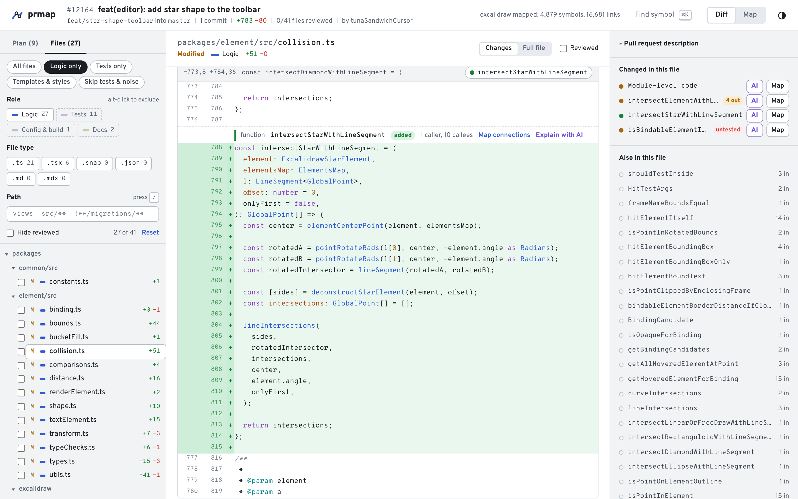
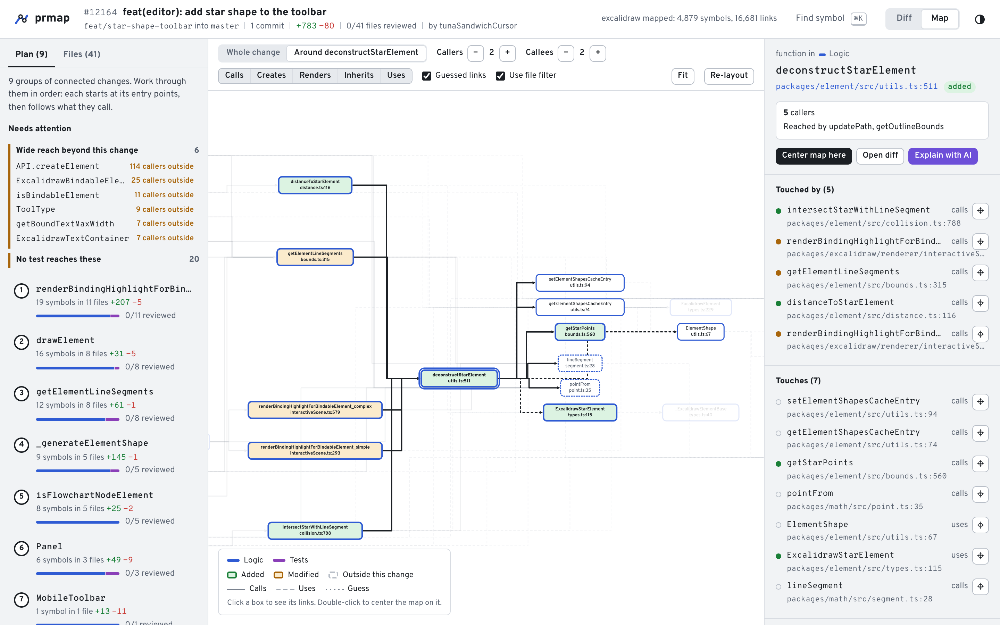
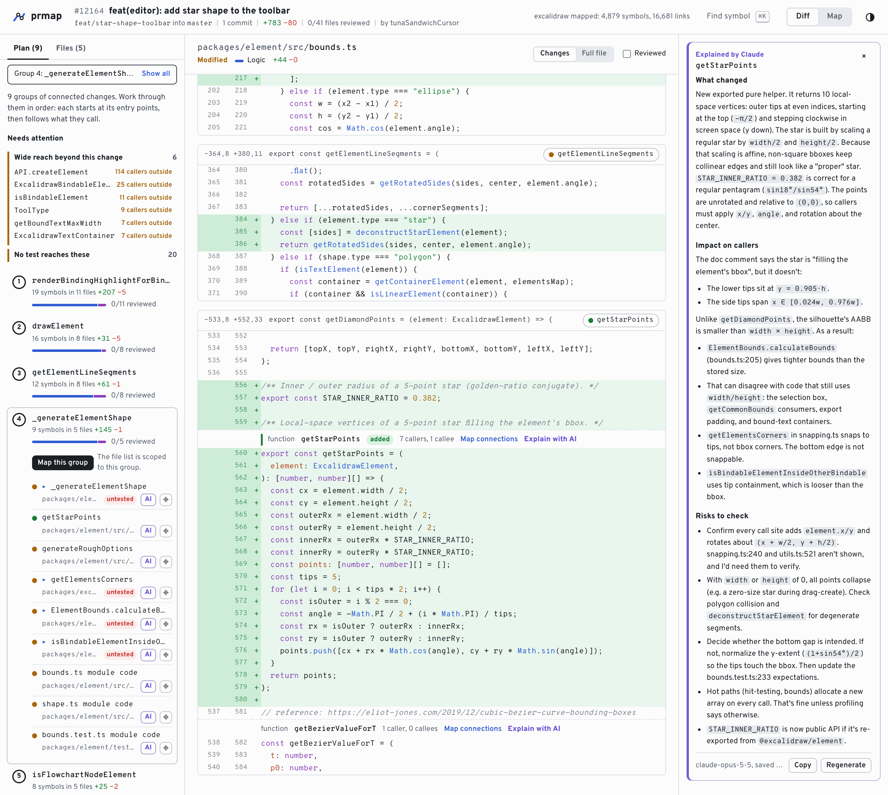
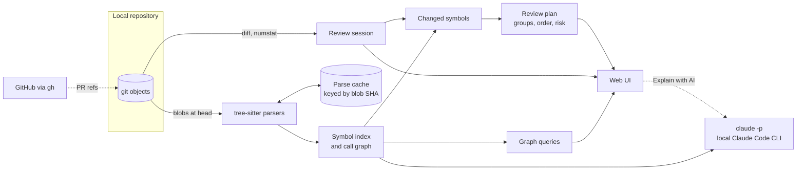

<div align="center">


# prmap

**A map for reviewing big pull requests.**

Split a 300-file PR into groups of connected changes, read each group in a sensible order,<br>
filter out the noise, and see what every changed function touches and what touches it.

[](LICENSE)


[Quick start](#quick-start) ·
[Reviewing a big PR](#reviewing-a-big-pr) ·
[Features](#features) ·
[How it works](#how-it-works) ·
[Development](#development)

</div>

<br>

<picture>
  <source media="(prefers-color-scheme: dark)" srcset="docs/images/review-dark.png">
  
</picture>

<br>

## Why prmap

A diff viewer shows a pull request as an alphabetical list of files. That works for ten files. For a few hundred, the reviewer has to rebuild the structure of the change in their head: which edits belong together, where the change starts, which tests cover it, and what else in the codebase depends on the code that moved.

prmap builds that structure for you. It parses the code at the PR's head with tree-sitter, links every function, method, class and component to what it calls, and uses those links to:

- **Plan the review.** It splits the change into groups of connected edits and orders each group from its entry points down to the code they call.
- **Cut the noise.** It sorts every changed file by role (logic, tests, templates, config, generated) so you can review one kind at a time.
- **Show the blast radius.** For any function or class, it shows what it touches and what touches it, across files, with risk signals like callers outside the PR and code no test reaches.
- **Explain a change on demand.** One click sends a changed function, its diff and its callers to Claude through your local [Claude Code](https://claude.com/claude-code) CLI. The answer covers what changed, the impact on callers, and what to verify.

Everything runs on your machine against your local clone. Nothing leaves it unless you click **Explain with AI**, and then only the context for that one symbol goes to Claude.

## Contents

- [Quick start](#quick-start)
- [Reviewing a big PR](#reviewing-a-big-pr)
- [Features](#features)
  - [Review plan](#review-plan)
  - [Filters](#filters)
  - [Connection map](#connection-map)
  - [Diff view](#diff-view)
  - [Explain with AI](#explain-with-ai)
- [Keyboard shortcuts](#keyboard-shortcuts)
- [Command line](#command-line)
- [Configuration](#configuration)
- [How it works](#how-it-works)
- [Language support](#language-support)
- [Performance](#performance)
- [Privacy and safety](#privacy-and-safety)
- [Limitations](#limitations)
- [Development](#development)
- [Roadmap](#roadmap)
- [License](#license)

## Quick start

**Requirements**

| Tool | Version | Used for |
| --- | --- | --- |
| [uv](https://docs.astral.sh/uv/) | any recent | Python environment and the `prmap` command |
| Python | 3.11+ | the analysis server (uv can install it for you) |
| Node.js | 18+ | building the web UI once |
| git | 2.x | reading the repository |
| [GitHub CLI](https://cli.github.com/) | optional | opening pull requests (`gh auth login`) |
| [Claude Code](https://claude.com/claude-code) | optional | **Explain with AI** (uses your existing `claude` login) |

**Install**

```bash
git clone https://github.com/rodolfotorres02/pr-map.git
cd pr-map
make install       # Python and Node dependencies
make build         # build the web UI into the Python package
make install-cli   # put `prmap` on your PATH
```

`make install-cli` runs `uv tool install --editable ./backend`, which places `prmap` in uv's tool directory (usually `~/.local/bin`). If your shell can't find it, run `uv tool update-shell`. The install is editable, so pulling new changes and running `make build` updates the command without reinstalling.

**Run it inside any repository**

```bash
cd ~/code/your-project
prmap                  # pick a PR or two branches in the browser
prmap --pr 1234        # open a GitHub pull request directly
prmap --base main      # review the current branch against main
```

prmap opens `http://127.0.0.1:7420` in your browser. Opening pull requests needs the GitHub CLI to be logged in (`gh auth login`). Comparing branches works without it.

## Reviewing a big PR

This is the workflow prmap is built around.

1. **Open the PR.** Pick it from the list of open pull requests, paste its number or URL, or compare two branches. prmap fetches the PR and starts mapping the code in the background. On a large monorepo this takes a second or two, and later runs reuse a cache.
2. **Start with "Needs attention".** The Plan tab lists the changes that carry the most risk:
   - changes with many callers outside the PR,
   - changed logic that no test reaches,
   - deleted functions that are still referenced somewhere.
3. **Work group by group.** Each numbered group is a set of changes that call into each other. Open group 1: the file list, the map and `j`/`k` navigation all narrow to that group, in reading order, starting at its entry points (marked ▸).
4. **Read, then mark reviewed.** Press `r` to mark the file reviewed and jump to the next unreviewed one. Each group shows its progress, and its number turns green when you've reviewed all its files.
5. **Check the blast radius.** Click **Map connections** on any changed function to see its callers and callees. Use the depth controls to follow callers further out, and check the inspector for which tests reach it. When a change isn't obvious, click **Explain with AI** for a summary of what changed, who is affected and what to verify.
6. **Sweep the rest.** Templates, config, docs and other files that aren't part of a code group are listed under **Outside the groups**. The Files tab's presets let you sweep them by role, for example **Templates & styles** or **Tests only**.

## Features

### Review plan

The Plan tab turns the change into a numbered reading list.

- **Groups of connected changes.** Changed symbols that call each other, directly or through one unchanged helper, form a group, as do changed methods of the same class. Tests and module-level code attach to the group they exercise instead of gluing unrelated groups together. Very large connected areas are split into communities, so a monorepo-wide refactor still produces groups of a reviewable size.
- **Reading order.** Within a group, symbols are ordered top-down: entry points first, then what they call. Tests come last.
- **Progress.** Each group shows how many of its files you have reviewed.
- **Needs attention:**

  | Signal | Meaning |
  | --- | --- |
  | **Wide reach** | The changed symbol has callers in files that are *not* part of the PR. Changing its behaviour affects code nobody is reviewing. |
  | **No test reaches these** | No test calls the changed function within two hops. |
  | **Removed but still referenced** | A deleted function or class is still imported or called somewhere at the PR's head. |

<picture>
  <source media="(prefers-color-scheme: dark)" srcset="docs/images/group-map-dark.png">
  
</picture>

### Filters

Every changed file gets a **role** and an **extension**, and filters on the two combine. "Only templates and JavaScript" is an extension filter; "logic without tests" is a role filter.

| Role | Typical files |
| --- | --- |
| Logic | application source code |
| Tests | `test_*.py`, `*_test.py`, `*.test.ts`, `*.spec.tsx`, `tests/`, `__tests__/`, fixtures, snapshots, `conftest.py` |
| Templates | `.html`, Jinja/Django, Handlebars, EJS, Pug, ERB, … |
| Styles | `.css`, `.scss`, `.less`, … |
| Config & build | `package.json`, `pyproject.toml`, `Dockerfile`, CI workflows, `*.config.ts`, … |
| Migrations | `migrations/`, `alembic/versions/`, `db/migrate/` |
| Docs | Markdown, reStructuredText, `docs/` |
| Generated & locks | lockfiles, `*.min.js`, `dist/`, `vendor/`, generated clients |
| Assets | images, fonts, media |

- **Presets:** All files, Logic only, Tests only, Templates & styles, Skip tests & noise.
- **Role and file-type chips:** a click narrows to that chip, and further clicks add more. Alt-click shows everything *except* that chip.
- **Path patterns:** space- or comma-separated globs. Prefix a pattern with `!` to exclude it. A plain word matches any path that contains it.

  ```text
  views                      paths containing "views"
  src/api/**  src/core/**    only these trees
  !**/migrations/**          everything except migrations
  ```
- **Hide reviewed** to see only what's left.
- prmap remembers your filter for each repository, and your reviewed marks for each review.

If your project uses unusual layouts, see [Configuration](#configuration) to teach prmap your own roles.

<picture>
  <source media="(prefers-color-scheme: dark)" srcset="docs/images/filters-dark.png">
  
</picture>

### Connection map

Select any function, method, class or component to see what it **touches** (callees, to the right) and what **touches it** (callers, to the left). Selecting a class includes all of its methods.

<picture>
  <source media="(prefers-color-scheme: dark)" srcset="docs/images/connection-map-dark.png">
  
</picture>

- **Two modes.** *Around a symbol* shows a symbol's neighbourhood with adjustable caller and callee depth. *Whole change* (or *This group* while a plan group is active) shows the changed symbols, grouped into one zone per file, with the unchanged helpers that connect them.
- **Link types**, each of which you can toggle:

  | Link | Example |
  | --- | --- |
  | Calls | `audit(order)`, `self.mailer.send()`, `api.load()` |
  | Creates | `Checkout(...)`, `new OrderStore()` |
  | Renders | `<OrderRow />` |
  | Inherits | `class Order(BaseModel)`, `extends`, `implements` |
  | Uses | passed without being called: callbacks, Django `urls.py` → views, type annotations |

- **Exact or guessed.** A link is exact when prmap resolved it through imports, `self`/`this`, inheritance or a known variable type. When only the method name matched (`obj.process()` with an unknown `obj`), the link is a guess. Guesses are drawn dotted and can be hidden.
- **Reading the map:**

  | Visual | Meaning |
  | --- | --- |
  | Border colour | the file's role (Logic, Tests, …) |
  | Green / amber fill | symbol added / modified in this PR |
  | Dashed border | code outside this change |
  | Double border | class, interface or object |
  | Solid / dashed / dotted line | call / use / guess |

- **Inspector.** Click a symbol to see:
  - its full list of callers and callees, including ones not drawn,
  - its risk line (callers outside the PR, which tests reach it),
  - its source code.

  Double-click a symbol to re-centre the map on it.
- **Find any symbol** with `⌘K` / `Ctrl+K`, not only changed ones.

### Diff view

- Syntax-highlighted unified diff. Switch between the changes only or the full file.
- **Changed-function markers.** Each function or class header in the diff shows whether it was added or modified, how many callers and callees it has, and a **Map connections** button.
- Hunk headers list the changed symbols they touch.
- The inspector lists the file's changed symbols, with risk chips, and the symbols it leaves untouched.

### Explain with AI

Next to **Map connections**, every function and class in the diff has an **Explain with AI** button. The inspector, the map and the plan's reading lists have one too. Click it and Claude streams a short review note into the inspector, in three sections:

- **What changed:** the behavioural change, not a line-by-line restatement of the diff.
- **Impact on callers:** which callers are affected and how, including callers outside the PR.
- **Risks to check:** edge cases, missing tests, and questions to ask the author.

<picture>
  <source media="(prefers-color-scheme: dark)" srcset="docs/images/explain-dark.png">
  
</picture>

**How it works.** prmap doesn't call an API itself. It bridges to the [Claude Code](https://claude.com/claude-code) CLI on your machine:

1. prmap builds a focused prompt from the code map:
   - the PR title and description,
   - the symbol's diff and its source at the PR head (or at the base, for deleted code),
   - its callers and callees, with call sites, marking guessed links and links outside the PR,
   - its risk signals.
2. It pipes the prompt to `claude -p --output-format stream-json`, using your existing `claude` login, and streams the answer into the page.

Claude runs with **no tools, no MCP servers and no skills**, under a short reviewer system prompt. That has three effects:

- **It can't touch your repository.** It sees only what prmap sends.
- **It's cheap.** Skipping Claude Code's full agent context makes a typical explanation cost a few cents and take 10–20 seconds.
- **It's free to reopen.** Finished answers are cached per review. Reopening one is instant and free, and **Regenerate** asks again.

| Variable | Purpose |
| --- | --- |
| `PRMAP_CLAUDE_MODEL` | Model for explanations (passed to `claude --model`, e.g. `sonnet`). Defaults to your Claude Code default. |
| `PRMAP_CLAUDE_ARGS` | Extra flags for `claude`, e.g. `--effort low`. |
| `PRMAP_CLAUDE_BIN` | Path to the `claude` executable, if it isn't on your `PATH`. |

If `claude` isn't installed, the buttons are hidden. If it isn't logged in, the panel tells you to run `claude` once and log in.

## Keyboard shortcuts

| Key | Action |
| --- | --- |
| `j` / `k` | Next / previous file (follows the reading order inside a plan group) |
| `r` | Mark the file reviewed and jump to the next unreviewed one (press again to unmark) |
| `p` | Switch between the Plan and Files tabs |
| `m` | Switch between diff and map |
| `o` | Map of the whole change (or of the active group) |
| `/` | Focus the path filter |
| `⌘K` / `Ctrl+K` | Find a function, class or method |
| `Esc` | Close the finder / leave the path filter |
| Alt-click a chip | Show everything except that role or file type |

## Command line

```text
prmap [--repo PATH] [--pr NUMBER|URL] [--base REF] [--head REF]
      [--host HOST] [--port PORT] [--no-browser]
```

| Option | Default | Description |
| --- | --- | --- |
| `--repo` | `.` | Path to a local git clone. |
| `--pr` | | Open this GitHub pull request (number or URL) right away. |
| `--base` | default branch | Base branch, tag or commit to compare against. |
| `--head` | current branch | Branch, tag or commit to review. |
| `--host` | `127.0.0.1` | Interface to bind. |
| `--port` | `7420` | Port. On localhost, the next free port is used if it is taken. |
| `--no-browser` | off | Don't open a browser tab. |

**Pull requests.**
- Open PRs are diffed against the merge base with the current tip of their base branch, like GitHub's *Files changed* tab.
- Merged and closed PRs are diffed against the base commit they were opened against.
- PRs from forks work: prmap fetches `refs/pull/<n>/head` from the remote that points at the base repository.

## Configuration

Add an optional `.prmap.toml` at the root of the repository you review:

```toml
[categories]
# gitignore-style patterns. The first matching category wins over the built-in rules.
# Keys: source, test, template, style, config, migration, docs, generated, asset, other
test      = ["src/testing/**", "**/factories.py"]
generated = ["src/api/client/**"]
template  = ["emails/**/*.txt"]

[index]
# Extra paths to leave out of the code map. These add to the defaults:
# node_modules/, vendor/, dist/, build/, .next/, coverage/, .venv/, *.min.js, *.bundle.js, *.d.ts
exclude = ["legacy/**", "scripts/one-off/**"]
max_file_kb = 512   # files larger than this are not parsed (default 512)
```

| Environment variable | Purpose |
| --- | --- |
| `PRMAP_CACHE_DIR` | Where the parse cache lives (default `~/.cache/prmap`, or `$XDG_CACHE_HOME/prmap`). |
| `PRMAP_CLAUDE_MODEL`, `PRMAP_CLAUDE_ARGS`, `PRMAP_CLAUDE_BIN` | Explain with AI settings. See [Explain with AI](#explain-with-ai). |

## How it works



1. **Read git, never the working tree.** The diff, file contents and file lists come from git's object database. Your checkout, index and stash are never touched. For pull requests, prmap fetches the PR head and base into `refs/prmap/pr/<n>/…`, which is the only thing it writes.
2. **Parse.** Every Python and JS/TS file at the head commit is parsed with tree-sitter into symbols, call sites, references, imports, exports and simple type hints. Results are cached in SQLite by blob SHA, so unchanged files are never parsed twice, even across branches. Parsing runs in parallel on large repositories.
3. **Resolve.** Call sites are linked to definitions through:
   - relative and absolute imports, package `__init__` re-exports and star imports,
   - ES module imports, barrel files (`export * from`), aliased re-exports and CommonJS `require`,
   - `tsconfig`/`jsconfig` `paths` aliases (including from ancestor configs) and workspace packages by their `package.json` name,
   - `self`/`this`/`cls`, `super()`, and inheritance chains,
   - variable types inferred from constructors (`x = Order(...)`, `new Store()`), annotations, TypeScript parameter properties and return types,
   - compound components such as `Menu.Item = MenuItem`.

   Local variables are tracked so they don't shadow module-level names.
4. **Find what changed.** One `git diff` across the whole PR is mapped onto symbol line ranges at both ends. Each symbol is then classified as added, modified or deleted.
5. **Plan.** prmap clusters changed symbols with union-find over exact links, one-hop bridges and class membership. Oversized clusters are split with deterministic Louvain community detection, and each group is ordered from its entry points. Risk comes from a graph walk: callers outside the changed files, and tests within two hops upstream.

The UI is React and TypeScript with [Cytoscape.js](https://js.cytoscape.org/): dagre layouts for symbol neighbourhoods, fCoSE for file-zone maps. It is built into the Python package and served by the same local FastAPI process.

## Language support

| | Python | JavaScript / TypeScript |
| --- | --- | --- |
| Functions, classes, methods | ✓ | ✓ including arrow functions, class fields and object-literal methods |
| Interfaces, type aliases, enums | | ✓ |
| Imports and re-exports | ✓ relative, absolute, `__init__` re-exports, star imports | ✓ ESM, barrels, CommonJS, `tsconfig` paths, workspace packages |
| Instance calls via `self` / `this` | ✓ including inherited methods | ✓ including constructor parameter properties |
| Inferred variable types | ✓ constructors, annotations, return types, Django `Model.objects` | ✓ `new`, annotations, return types |
| Components | | ✓ JSX / TSX, `memo`/`forwardRef` wrappers, `Menu.Item` patterns |
| Framework links | Django `urls.py` → views, decorators | React component trees |

All other files (templates, styles, config, Go, Java and others) still get categories, filters and diffs. Only the code map is limited to the languages above.

## Performance

Measured on an Apple Silicon laptop with a cold parse cache unless noted.

| Repository | Size | Map the code | Changed symbols | Review plan |
| --- | --- | --- | --- | --- |
| django-rest-framework | 161 Python files | 0.4 s (0.05 s cached) | 0.01 s, 536-file diff | – |
| excalidraw | 691 TS/TSX files | 1.0 s (0.4 s cached) | 0.01 s, 1,509-file diff | 0.3 s for 3,494 changed symbols |
| synthetic monorepo diff | 3,485 changed files | 1.8 s (0.9 s cached) | 0.03 s | – |

Graph queries return in well under 100 ms. The whole-change map is capped at the 250 most connected symbols, so the browser stays responsive. Use plan groups to map the rest.

## Privacy and safety

- **Local first.** The server binds to `127.0.0.1`. There is no telemetry, and fonts are bundled. Network traffic happens only in two cases:
  - `git fetch` and `gh`, when you open a pull request,
  - your local Claude Code CLI, when you click **Explain with AI**. Only the context for that one symbol is sent: its diff, source, callers and the PR description.
- **Read-only on your code.** prmap never checks out branches or modifies your working tree. Fetched PR refs live under `refs/prmap/`, and you can delete them with `git for-each-ref --format='%(refname)' refs/prmap | xargs -n1 git update-ref -d`.
- **Your review state stays in your browser.** Reviewed marks and filters live in `localStorage`. Pushing new commits to a PR starts a new review, because the review is keyed by its compared commits.

## Limitations

prmap's graph is static analysis, not a type checker. Treat a missing link as *unknown*, not *unused*, and treat dotted links as guesses.

- Dynamic dispatch, metaprogramming, dependency-injection containers, signals and string-based lookups (other than Django URL routing) are not resolved.
- Methods inherited from third-party base classes (Django's `Model.save`, React's `Component`) end at the boundary of your repository.
- The code map covers Python and JavaScript/TypeScript only.
- On very large diffs, git's rename detection limit can report some moves as an add plus a delete.
- Reviewed marks are per browser and are not synced to GitHub.
- AI explanations are only as good as the context prmap sends. Claude sees the symbol, its diff and its direct neighbours, not the whole repository. Treat its notes as a reviewer's aid, not a verdict.

## Development

```bash
make install       # backend: uv sync, frontend: npm install
make test          # backend test suite (pytest)
make build         # production UI → backend/src/prmap/static
```

UI development loop, in two terminals:

```bash
make dev-api                 # API on :7420 for this repo; REPO=/path/to/repo to review another
make dev-ui                  # Vite on :5173 with hot reload, proxying /api to :7420
```

The test suite builds throwaway git repositories with Python (Django-style) and TypeScript/React code on two branches. It covers classification, diff parsing, cross-file resolution, the review plan, the GitHub PR flow (against a local bare remote), the HTTP API and the Claude bridge. The bridge tests use a fake `claude` executable, so they never call the real Claude.

<details>
<summary><b>Project layout</b></summary>

```text
backend/                     Python package `prmap` (managed with uv)
  src/prmap/
    cli.py                   `prmap` command
    server.py                FastAPI app: JSON API and the built UI
    review.py                review sessions, changed files and changed symbols
    plan.py                  review plan: groups, reading order, risk
    graph.py                 neighbourhood and whole-change graph queries
    explain.py               Explain with AI: prompt building and the `claude -p` bridge
    gitrepo.py               read-only git access, PR ref fetching
    github.py                pull requests via the GitHub CLI
    classify.py              file roles and languages
    config.py                `.prmap.toml`
    diffparse.py             unified diff parsing
    indexer.py               index build, parallel parsing, SQLite parse cache
    analysis/
      python_parser.py       tree-sitter extraction for Python
      js_parser.py           tree-sitter extraction for JS, JSX, TS, TSX
      index.py               symbol table, module resolution, call graph
  tests/
frontend/                    React + Vite + TypeScript UI
  src/components/            ReviewScreen, PlanPanel, DiffView, MapView, Inspector, …
  src/lib/                   API client, filters, highlighting, storage
docs/images/                 README assets
Makefile
```

</details>

<details>
<summary><b>HTTP API</b></summary>

The UI talks to a small JSON API, which you can also script against. Interactive docs are served at `/api/docs`.

| Method | Path | Purpose |
| --- | --- | --- |
| `GET` | `/api/repo` | Repository info and branches |
| `GET` | `/api/prs` | Open pull requests (via `gh`) |
| `POST` | `/api/reviews` | Open a review: `{"source": "pr", "pr": "123"}` or `{"source": "branches", "base": "main", "head": "feature"}` |
| `GET` | `/api/reviews/{id}/status` | Code-map build progress |
| `GET` | `/api/reviews/{id}/file?path=` | Diff hunks and symbols for one file |
| `GET` | `/api/reviews/{id}/changes` | Changed symbols |
| `GET` | `/api/reviews/{id}/plan` | Review plan: groups, reading order, risk |
| `POST` | `/api/reviews/{id}/graph` | Neighbourhood of symbols (`seeds`, `depth_in`, `depth_out`) |
| `POST` | `/api/reviews/{id}/overview` | Whole-change or group map |
| `GET` | `/api/reviews/{id}/search?q=` | Find symbols by name |
| `GET` | `/api/reviews/{id}/source?path=&start=&end=` | Source lines at head or base |
| `POST` | `/api/reviews/{id}/explain` | Explain a symbol with Claude (`{"symbol_id": "...", "refresh": false}`), streamed as server-sent events |

</details>

## Roadmap

These are ideas, not commitments:

- Whitespace-insensitive diffs for reformatting-heavy PRs
- Links from templates to the views that render them (`render(request, "orders/detail.html")`)
- Carry reviewed marks across force-pushes by comparing file contents
- More languages through tree-sitter: Go, Java, Kotlin, Ruby
- Export review notes to GitHub review comments

## License

[MIT](LICENSE) © 2026 Rodolfo Torres

The screenshots show prmap reviewing public pull requests in open-source projects; their code belongs to their respective authors.
